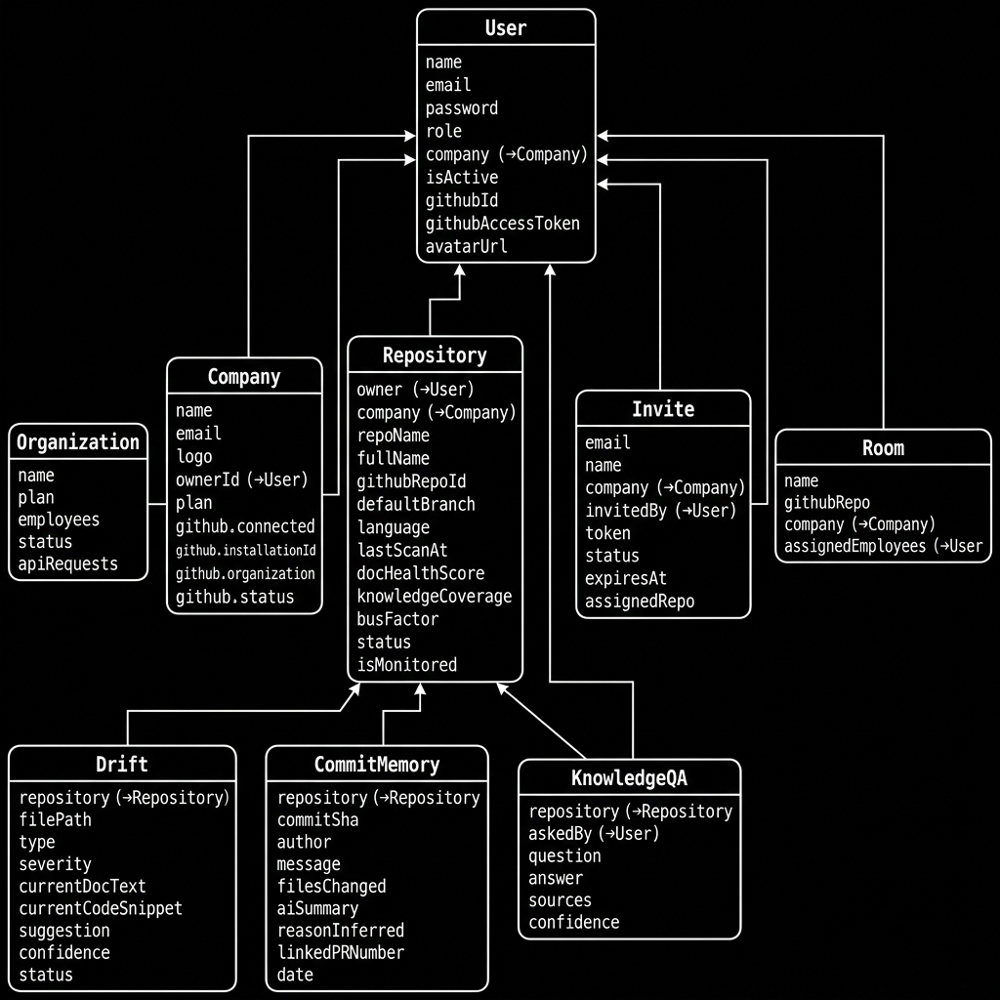

# 🧠 WhyCode — AI-Powered Knowledge Recovery & Documentation Intelligence

> *Stop asking "Why does this code exist?" — WhyCode answers it for you.*

WhyCode (internally **CodeMemory**) is a full-stack MERN application that uses AI to automatically detect documentation drift, reconstruct the intent behind code changes, and surface tribal knowledge hidden in your Git history. Connect a GitHub repository and get instant insight into **what** your code does, **why** it exists, and **who** truly owns it.

---

## ✨ Features

| Feature | Description |
|---|---|
| **Documentation Drift Detection** | AI compares docstrings/comments against current code and flags outdated documentation with severity scores |
| **Intent Reconstruction** | "Why does this function exist?" — answered using commit history, PR discussions, and Git blame |
| **AI Knowledge Chat** | Ask free-text questions about your codebase; get answers grounded in real commit and PR evidence |
| **Repo Health Dashboard** | Doc health score, knowledge coverage %, and bus-factor risk per repository |
| **Commit Memory Timeline** | Per-file timeline showing who changed what, when, and why |
| **Team & Organization Management** | Multi-tenant support with companies, teams, invites, and role-based access |
| **GitHub OAuth + JWT Auth** | Secure login via GitHub; all API calls scoped to the user's own access token |

---

## 🛠️ Tech Stack

| Layer | Technology |
|---|---|
| **Frontend** | React 19 (Vite), React Router v7, TanStack Query v5, Axios, Lucide React |
| **Backend** | Node.js ≥20, Express.js (ESM), express-async-errors |
| **Database** | MongoDB Atlas, Mongoose ODM |
| **Authentication** | JWT + GitHub OAuth |
| **AI** | Google Gemini API (`@google/genai`) |
| **GitHub Integration** | Octokit REST + GitHub GraphQL API v4 |
| **Email** | Nodemailer |
| **Dev Tools** | Nodemon, Vite, OxLint, Concurrently |

---

## 📁 Project Structure

```
WhyCode/
├── client/                          # React frontend (Vite)
│   ├── src/
│   │   ├── components/              # Reusable UI components
│   │   ├── pages/                   # Route-level page components
│   │   ├── context/                 # AuthContext, RepoContext
│   │   └── services/                # Axios API wrappers
│   ├── index.html
│   └── vite.config.js
│
├── server/                          # Express backend (ESM)
│   ├── config/
│   │   ├── db.js                    # MongoDB connection
│   │   ├── github.js                # Octokit client factory
│   │   └── ai.js                    # Google Gemini client
│   ├── controllers/                 # Route handler logic
│   ├── models/                      # Mongoose schemas
│   │   ├── User.js
│   │   ├── Repository.js
│   │   ├── Drift.js
│   │   ├── CommitMemory.js
│   │   ├── KnowledgeQA.js
│   │   ├── Organization.js
│   │   ├── Company.js
│   │   ├── Invite.js
│   │   └── Room.js
│   ├── routes/                      # Express route definitions
│   ├── middleware/
│   │   ├── authMiddleware.js        # JWT verification
│   │   └── errorHandler.js
│   ├── services/
│   │   ├── githubService.js         # GitHub API calls
│   │   └── aiService.js             # AI prompt orchestration
│   ├── utils/
│   │   └── seedAdmin.js             # Admin seeder on startup
│   └── app.js                       # Express app entry point
│
├── .env                             # Root environment variables
└── package.json                     # Root concurrently scripts
```

---

## 🚀 Getting Started

### Prerequisites

- **Node.js** ≥ 20.0.0
- **npm** ≥ 9
- A **MongoDB Atlas** cluster (free tier works)
- A **GitHub OAuth App** ([create one here](https://github.com/settings/developers))
- A **Google Gemini API Key** ([get one here](https://aistudio.google.com/))

---

### 1. Clone the Repository

```bash
git clone https://github.com/your-username/WhyCode.git
cd WhyCode
```

### 2. Configure Environment Variables

Create a `.env` file in the **root** of the project:

```env
# MongoDB
MONGO_URI=mongodb+srv://<user>:<password>@cluster.mongodb.net/whycode

# JWT
JWT_SECRET=your_super_secret_jwt_key

# GitHub OAuth App
GITHUB_CLIENT_ID=your_github_oauth_client_id
GITHUB_CLIENT_SECRET=your_github_oauth_client_secret

# Google Gemini AI
GEMINI_API_KEY=your_google_gemini_api_key

# Server / Client
PORT=5000
CLIENT_URL=http://localhost:5173
```

### 3. Install Dependencies

```bash
# Install all dependencies (root + server + client) in one command
npm run install-all
```

### 4. Run the App (Development)

```bash
# Runs both server (port 5000) and client (port 5173) concurrently
npm run dev
```

Or run them individually:

```bash
npm run server   # Backend only
npm run client   # Frontend only
```

---

## 🗄️ Database Connection

WhyCode uses **MongoDB Atlas** (cloud-hosted MongoDB) via **Mongoose ODM**. The connection is managed in [`server/config/db.js`](./server/config/db.js).

### MongoDB Atlas Setup

1. **Create a free cluster** at [mongodb.com/atlas](https://www.mongodb.com/cloud/atlas/register)
2. **Create a database user** with read/write access
3. **Whitelist your IP** (or use `0.0.0.0/0` for development)
4. **Copy the connection string** from *Connect → Drivers → Node.js*

Your `MONGO_URI` in `.env` should look like:

```env
MONGO_URI=mongodb+srv://<username>:<password>@cluster0.xxxxx.mongodb.net/WhyCode?retryWrites=true&w=majority
```

> Replace `<username>`, `<password>`, and the cluster subdomain with your own values.

---

### `server/config/db.js` — Full Connection Code

```js
import mongoose from "mongoose";

// ─── Connection Options ───────────────────────────────────────────────────────
const MONGO_OPTIONS = {
  serverSelectionTimeoutMS: 5000,  // fail fast if server is unreachable
  socketTimeoutMS: 45000,          // close sockets after 45s of inactivity
  maxPoolSize: 10,                 // maintain up to 10 socket connections
};

// ─── Event Listeners ──────────────────────────────────────────────────────────
mongoose.connection.on("connected", () => {
  console.log("✅ [MongoDB] Connection established");
});

mongoose.connection.on("error", (err) => {
  console.error(`❌ [MongoDB] Connection error: ${err.message}`);
});

mongoose.connection.on("disconnected", () => {
  console.warn("⚠️  [MongoDB] Disconnected from database");
});

// ─── Graceful Shutdown ────────────────────────────────────────────────────────
const gracefulShutdown = async (signal) => {
  console.log(`\n🔌 [MongoDB] Received ${signal}. Closing connection...`);
  await mongoose.connection.close();
  console.log("🔌 [MongoDB] Connection closed. Exiting process.");
  process.exit(0);
};

process.on("SIGINT", () => gracefulShutdown("SIGINT"));   // Ctrl+C
process.on("SIGTERM", () => gracefulShutdown("SIGTERM")); // Docker / PM2 stop

// ─── Connect Function ─────────────────────────────────────────────────────────
const connectDB = async () => {
  if (!process.env.MONGO_URI) {
    console.error("❌ [MongoDB] MONGO_URI is not defined in environment variables.");
    process.exit(1);
  }

  try {
    console.log("🔄 [MongoDB] Connecting to database...");
    const conn = await mongoose.connect(process.env.MONGO_URI, MONGO_OPTIONS);
    console.log(`📦 [MongoDB] Host     : ${conn.connection.host}`);
    console.log(`📦 [MongoDB] Database : ${conn.connection.name}`);
  } catch (err) {
    console.error(`❌ [MongoDB] Failed to connect: ${err.message}`);
    process.exit(1);
  }
};

export default connectDB;
```

### Connection Options Explained

| Option | Value | Purpose |
|---|---|---|
| `serverSelectionTimeoutMS` | `5000` ms | Fail fast if Atlas is unreachable (avoids long hangs) |
| `socketTimeoutMS` | `45000` ms | Closes idle sockets after 45 seconds |
| `maxPoolSize` | `10` | Max simultaneous connections in the pool |

### Lifecycle Events

| Event | Trigger |
|---|---|
| `connected` | Successfully authenticated and connected to MongoDB |
| `error` | Any connection or query-level error emitted by Mongoose |
| `disconnected` | Connection dropped (network issue, Atlas restart, etc.) |

### Graceful Shutdown

The connection listens for **SIGINT** (`Ctrl+C`) and **SIGTERM** (Docker/PM2 stop) signals. On shutdown it:
1. Logs the signal received
2. Cleanly closes the Mongoose connection
3. Exits the Node.js process

This prevents connection leak warnings in Atlas and ensures in-flight operations complete.

### Expected Console Output on Startup

```
🔄 [MongoDB] Connecting to database...
✅ [MongoDB] Connection established
📦 [MongoDB] Host     : cluster0.xxxxx.mongodb.net
📦 [MongoDB] Database : WhyCode
```

### Database Schema Overview

WhyCode stores data across **9 Mongoose collections**:



```
WhyCode (MongoDB Database)
├── users             ← GitHub OAuth users with roles
├── repositories      ← Connected GitHub repos + health scores
├── drifts            ← AI-detected doc drift issues per file
├── commitmemories    ← Enriched commits with AI summaries
├── knowledgeqas      ← Stored Q&A pairs + cited sources
├── organizations     ← Top-level org grouping
├── companies         ← Company-level multi-tenant entities
├── invites           ← Pending team invitations
└── rooms             ← Collaboration rooms
```

---

## 🔌 API Endpoints

| Method | Endpoint | Description | Auth |
|---|---|---|---|
| `POST` | `/api/auth/github` | GitHub OAuth — exchange code for JWT | Public |
| `GET` | `/api/auth/me` | Get current user profile | JWT |
| `GET` | `/api/repositories` | List connected repositories | JWT |
| `POST` | `/api/repositories` | Connect a new GitHub repository | JWT |
| `POST` | `/api/scan/:repoId` | Trigger full AI scan on a repo | JWT |
| `GET` | `/api/drift/:repoId` | List open documentation drift issues | JWT |
| `PATCH` | `/api/drift/:driftId` | Accept or reject an AI suggestion | JWT |
| `GET` | `/api/timeline/:repoId/:filePath` | Get commit/intent timeline for a file | JWT |
| `POST` | `/api/chat/:repoId` | Ask AI a question about the codebase | JWT |
| `GET` | `/api/repositories/:repoId/risk` | Get bus-factor & risk analysis | JWT |
| `GET/POST` | `/api/companies` | Company management | JWT |
| `GET/POST` | `/api/employees` | Employee management | JWT |
| `POST` | `/api/invites` | Send team invitations | JWT |
| `GET` | `/api/team` | Team management | JWT |
| `GET` | `/api/admin` | Admin panel routes | JWT (Admin) |

A full Postman collection is available at `WhyCode_API_Postman_Collection.json`.

---

## 🔄 How It Works — End-to-End Flow

```
1. GitHub OAuth Login
   └─► Backend exchanges OAuth code → stores GitHub access token → issues JWT

2. Connect Repository
   └─► POST /api/repositories → fetches metadata from GitHub → saves to DB

3. Analyze Repository
   └─► POST /api/scan/:repoId
       ├─ Fetches file tree (GitHub Trees API)
       ├─ Fetches file content + commit history per file
       ├─ Runs AI drift detection on each file
       └─ Stores Drift & CommitMemory documents

4. View Dashboard
   └─► GET /api/drift/:repoId + /api/repositories/:repoId/risk
       └─ Renders doc health score, drift count, bus-factor cards

5. Inspect a File
   └─► GET /api/timeline/:repoId/:filePath
       ├─ Fetches Git blame (GitHub GraphQL)
       └─ AI reconstructs "why this code exists"

6. Ask a Question
   └─► POST /api/chat/:repoId
       ├─ Keyword-matches CommitMemory documents as grounding context
       └─ AI returns a cited, grounded answer

7. Resolve Drift
   └─► PATCH /api/drift/:driftId → marks suggestion as accepted/rejected
```

---

## 🧩 Key Data Models

| Model | Purpose |
|---|---|
| `User` | GitHub-authed user with role (`developer`, `team_lead`, `admin`) |
| `Repository` | Connected GitHub repo with health scores and scan status |
| `Drift` | A detected documentation drift issue with AI suggestion |
| `CommitMemory` | Enriched commit record with AI-generated summary and intent |
| `KnowledgeQA` | Stored Q&A pairs with grounding sources |
| `Organization` | Top-level org grouping users |
| `Company` | Company-level entity for multi-tenant support |
| `Invite` | Team invitation records |
| `Room` | Collaboration rooms |

---

## 🏗️ Scripts Reference

| Script | Command | Description |
|---|---|---|
| `dev` | `npm run dev` | Run client + server concurrently |
| `server` | `npm run server` | Start only the backend (nodemon) |
| `client` | `npm run client` | Start only the frontend (Vite) |
| `install-all` | `npm run install-all` | Install deps for root, server, and client |
| `build` | `cd client && npm run build` | Build frontend for production |
| `lint` | `cd client && npm run lint` | Lint frontend code with OxLint |

---

## 🤝 Contributing

1. Fork the repository
2. Create your feature branch: `git checkout -b feature/amazing-feature`
3. Commit your changes: `git commit -m 'feat: add amazing feature'`
4. Push to the branch: `git push origin feature/amazing-feature`
5. Open a Pull Request

---

## 📄 License

This project is licensed under the **ISC License**.

---

## 📚 Additional Documentation

- [`CodeMemory_MERN_Technical_Documentation.md`](./CodeMemory_MERN_Technical_Documentation.md) — Full technical deep-dive including all schemas, service methods, and AI prompt designs
- [`WhyCode_API_Postman_Collection.json`](./WhyCode_API_Postman_Collection.json) — Import into Postman to test all API endpoints

---

<p align="center">Built with ❤️ for developers who want to understand their codebase — not just ship it.</p>
