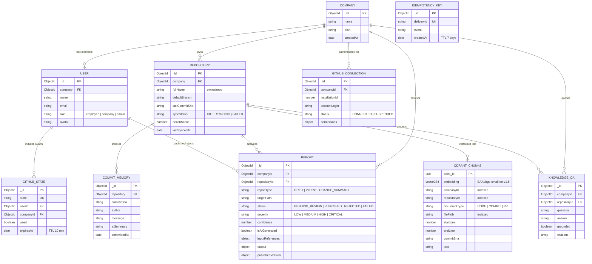

# 🗄️ WhyCode Database & Vector Store Schema Reference

This document provides the full structural specification of WhyCode's **MongoDB data models** and **Qdrant vector collection payloads**. Use this reference to visualize and redraw `assets/schema.png`.

---

## 1. Entity-Relationship Diagram (Mermaid)

---

## 2. MongoDB Mongoose Collections

### 1. `companies`
- `_id`: `ObjectId` (Primary Key)
- `name`: `String` (Required)
- `plan`: `String` (Enum: `free`, `pro`, `enterprise`)
- `createdAt`, `updatedAt`: `Date`

### 2. `users`
- `_id`: `ObjectId` (Primary Key)
- `company`: `ObjectId` (Ref: `Company`, Required)
- `name`: `String`
- `email`: `String` (Unique, Required)
- `password`: `String` (Hashed)
- `role`: `String` (Enum: `employee`, `company`, `admin`)
- `avatar`: `String`

### 3. `repositories`
- `_id`: `ObjectId` (Primary Key)
- `company`: `ObjectId` (Ref: `Company`, Required, Indexed)
- `fullName`: `String` (e.g. `saavi122/GigSure`, Indexed)
- `repoId`: `Number` (GitHub numeric repository ID)
- `defaultBranch`: `String` (Default: `main`)
- `lastCommitSha`: `String` (Atomic pointer for incremental diffing)
- `lastSyncedAt`: `Date`
- `syncStatus`: `String` (Enum: `IDLE`, `QUEUED`, `SYNCING`, `FAILED`)
- `healthScore`: `Number` (0–100)

### 4. `githubconnections`
- `_id`: `ObjectId` (Primary Key)
- `companyId`: `ObjectId` (Ref: `Company`, Required, Indexed)
- `installationId`: `Number` (GitHub App Installation ID, Required)
- `accountLogin`: `String` (GitHub `@username` or `@org`)
- `accountType`: `String` (`User` / `Organization`)
- `status`: `String` (Enum: `CONNECTED`, `SUSPENDED`, `REMOVED`)
- `permissions`: `Object`

### 5. `commitmemories`
- `_id`: `ObjectId` (Primary Key)
- `repository`: `ObjectId` (Ref: `Repository`, Required, Indexed)
- `commitSha`: `String` (Required, Indexed)
- `author`: `String`
- `authorLogin`: `String`
- `authorName`: `String`
- `message`: `String`
- `aiSummary`: `String` (Plain-language explanation of change)
- `reasonInferred`: `String` (Architectural intent)
- `date` / `committedAt`: `Date`
- Index: `{ repository: 1, commitSha: 1 }` (Unique)

### 6. `reports`
- `_id`: `ObjectId` (Primary Key)
- `companyId`: `ObjectId` (Ref: `Company`, Required, Indexed)
- `repositoryId`: `ObjectId` (Ref: `Repository`, Required, Indexed)
- `reportType`: `String` (Enum: `DRIFT`, `INTENT`, `CHANGE_SUMMARY`, Required, Indexed)
- `targetPath`: `String` (File path or `*`, Required, Indexed)
- `status`: `String` (Enum: `PENDING_REVIEW`, `PUBLISHED`, `REJECTED`, `FAILED`, Default: `PENDING_REVIEW`)
- `isAiGenerated`: `Boolean` (Default: `true`)
- `severity`: `String` (Enum: `LOW`, `MEDIUM`, `HIGH`, `CRITICAL`)
- `confidence`: `Number` (0.0 to 1.0)
- `requiresReview`: `Boolean`
- `inputReferences`: `{ chunkIds: [String], commitShas: [String], filePaths: [String], lineRanges: [{ start: Number, end: Number }] }`
- `output`: `{ title: String, summary: String, driftDetected: Boolean, driftDetails: String, intentDescription: String, suggestedDoc: String, changeSummary: String, citations: [String], evidenceCommits: [String] }`
- `publishedVersion`: `{ publishedBy: ObjectId, publishedAt: Date, title: String, summary: String, suggestedDoc: String, notes: String, isCustomEdited: Boolean }`

### 7. `knowledgeqas`
- `_id`: `ObjectId` (Primary Key)
- `companyId`: `ObjectId` (Ref: `Company`, Required, Indexed)
- `repositoryId`: `ObjectId` (Ref: `Repository`, Required, Indexed)
- `userId`: `ObjectId` (Ref: `User`)
- `question`: `String` (Required)
- `answer`: `String` (Required)
- `grounded`: `Boolean` (Strict threshold determination)
- `citations`: `[{ chunkId: String, path: String, lineRange: [Number], commitSha: String, url: String }]`

### 8. `idempotencykeys`
- `_id`: `ObjectId` (Primary Key)
- `deliveryId`: `String` (GitHub `X-GitHub-Delivery` GUID, Unique)
- `event`: `String` (`push`, `pull_request`, `installation`)
- `processedAt`: `Date`
- `createdAt`: `Date` (TTL Index: `expireAfterSeconds: 604800` — 7 days)

### 9. `githubstates`
- `_id`: `ObjectId` (Primary Key)
- `state`: `String` (Cryptographic random 64-hex string, Unique)
- `userId`: `ObjectId` (Ref: `User`)
- `companyId`: `ObjectId` (Ref: `Company`)
- `used`: `Boolean` (Default: `false`)
- `expiresAt`: `Date` (TTL Index: `expireAfterSeconds: 0` — 10 minutes)

---

## 3. Qdrant Vector Collection: `repository_chunks`

- **Vector Dimension**: `384` (`BAAI/bge-small-en-v1.5`)
- **Distance Metric**: `Cosine`
- **Point ID**: UUID v4 / deterministic Hash

### Payload Fields & Payload Indexes
| Field | Type | Index Type | Purpose |
|---|---|---|---|
| `companyId` | `string` | `keyword` | Hard multi-tenant boundary filter |
| `repositoryId` | `string` | `keyword` | Repository isolation filter |
| `documentType` | `string` | `keyword` | Filters chunks by `CODE`, `COMMIT`, `PR`, `ISSUE` |
| `filePath` | `string` | `keyword` | Targeted file retrieval and deletion |
| `chunkId` | `string` | `keyword` | Unique chunk identifier (`filePath:index`) |
| `startLine` | `integer` | `integer` | Start line in source file |
| `endLine` | `integer` | `integer` | End line in source file |
| `commitSha` | `string` | `keyword` | Associated Git commit hash |
| `text` | `string` | `text` | Scrubbed code/doc chunk text |
| `url` | `string` | `keyword` | Direct GitHub blob link |
